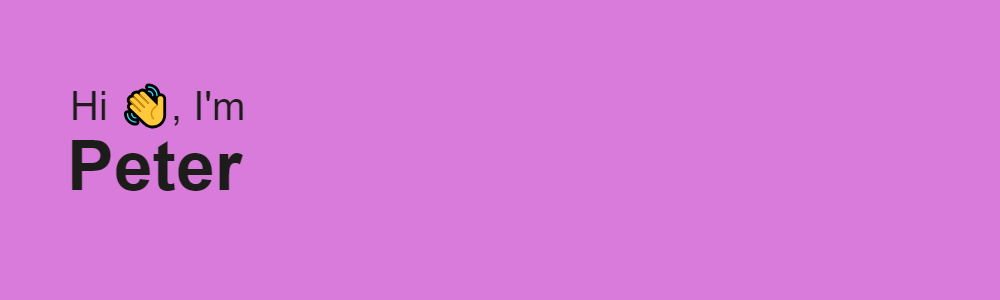

<h2 align="center">ᴀʙᴏᴜᴛ ᴍᴇ:</h2>

- :man_student: Magistrancy student of MPEI

- :zap: Looking for a job as a front-end developer

- :guitar: In my free time, I work on my portfolio projects, play a guitar and write music

- :clapper: Currently working on this page...

- :mailbox: How to reach me: 

<h2 align="center">Stack:</h2>

